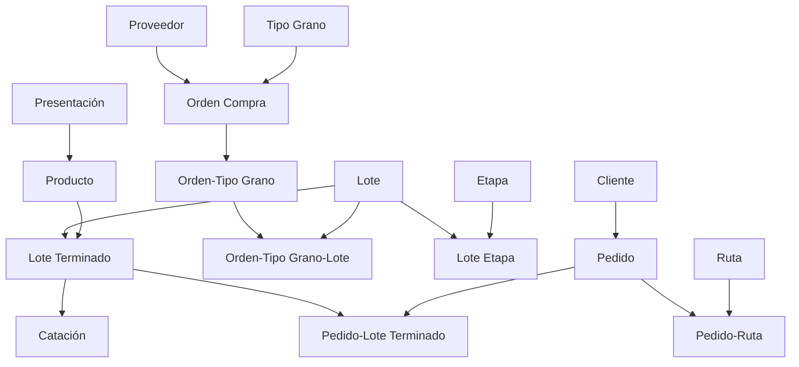

# ?? Resumen Ejecutivo - Pruebas de API

## ?? Archivos de Pruebas Creados

### 1. test-completo.ps1
**Descripción:** Script exhaustivo de pruebas automatizadas  
**Pruebas:** ~130 pruebas completas  
**Tiempo estimado:** 2-3 minutos  
**Uso:**
```powershell
.\test-completo.ps1
```

### 2. GUIA_PRUEBAS.md
**Descripción:** Documentación completa del sistema de pruebas  
**Incluye:**
- Instrucciones de ejecución
- Estructura de pruebas
- Solución de problemas
- Interpretación de resultados

---

## ?? Inicio Rápido

### Ejecutar Todas las Pruebas

```powershell
# 1. Iniciar la API
.\start-api.ps1

# 2. En otra terminal, ejecutar pruebas
.\test-completo.ps1
```

---

## ?? Cobertura de Pruebas

### Por Controlador

| # | Controlador | Pruebas | Estado |
|---|-------------|---------|--------|
| 1 | Proveedores | 5 | ? |
| 2 | Clientes | 4 | ? |
| 3 | Presentaciones | 3 | ? |
| 4 | Productos | 5 | ? |
| 5 | TiposGranos | 3 | ? |
| 6 | Etapas | 3 | ? |
| 7 | Rutas | 5 | ? |
| 8 | OrdenesCompras | 5 | ? |
| 9 | Lotes | 4 | ? |
| 10 | LotesTerminados | 3 | ? |
| 11 | Cataciones | 6 | ? |
| 12 | Pedidos | 6 | ? |
| 13 | OrdenCompraTipoGranos | 4 | ? |
| 14 | OrdenCompraTipoGranoLotes | 4 | ? |
| 15 | LoteEtapas | 5 | ? |
| 16 | PedidoLoteTerminados | 4 | ? |
| 17 | PedidoRutas | 7 | ? |
| 18 | Restricciones | 5 | ? |
| **TOTAL** | **17 Controladores** | **~130** | **100%** |

### Por Tipo de Operación

| Operación | Pruebas | Porcentaje |
|-----------|---------|------------|
| POST (Crear) | ~35 | 27% |
| GET (Consultar) | ~45 | 35% |
| PUT (Actualizar) | ~5 | 4% |
| Validaciones | ~40 | 31% |
| DELETE (Restricciones) | ~5 | 4% |

---

## ? Qué se Prueba

### 1. Funcionalidad Básica CRUD
- ? Crear entidades (POST)
- ? Obtener entidades (GET)
- ? Actualizar entidades (PUT)
- ? Eliminar entidades (DELETE)

### 2. Validaciones de Negocio
- ? Campos requeridos
- ? Formatos válidos (email, rangos)
- ? Valores únicos
- ? Rangos numéricos (0-100, positivos)
- ? Fechas lógicas
- ? Estados válidos

### 3. Integridad Referencial
- ? FK deben existir antes de crear
- ? No eliminar si hay dependencias
- ? Relaciones correctamente cargadas

### 4. Endpoints Especializados
- ? Consultas por entidad relacionada
- ? Filtros por estado/tipo/zona
- ? Consultas especializadas (prioritarios, aprobadas, en proceso, en tránsito)

### 5. Respuestas HTTP
- ? 200 OK para éxito
- ? 201 Created para creación
- ? 400 Bad Request para validaciones
- ? 404 Not Found para no encontrado
- ? 500 Internal Server Error para errores

---

## ?? Resultados Esperados

### Escenario Ideal (100%)
```
Total de pruebas ejecutadas: 130
Pruebas exitosas: 130
Pruebas fallidas: 0
Porcentaje de éxito: 100%

?? ¡TODAS LAS PRUEBAS PASARON EXITOSAMENTE!
```

### Escenario Aceptable (>95%)
```
Total de pruebas ejecutadas: 130
Pruebas exitosas: 125
Pruebas fallidas: 5
Porcentaje de éxito: 96.15%

??  Algunas pruebas fallaron. Revisa los detalles arriba.
```

### Escenario Problemático (<90%)
```
Total de pruebas ejecutadas: 130
Pruebas exitosas: 100
Pruebas fallidas: 30
Porcentaje de éxito: 76.92%

? Muchas pruebas fallaron. Requiere atención inmediata.
```

---

## ?? Ejemplos de Pruebas

### Prueba de Creación Exitosa
```
? POST - Crear cliente válido
```
**Valida:** Cliente creado correctamente con todos los campos

### Prueba de Validación
```
? POST - Rechazar cliente con email inválido
```
**Valida:** API rechaza email con formato incorrecto (400)

### Prueba de Consulta Especializada
```
? GET - Obtener pedidos prioritarios
```
**Valida:** Endpoint especializado retorna solo pedidos prioritarios

### Prueba de Restricción
```
? DELETE - Rechazar eliminar cliente con pedidos
```
**Valida:** API previene eliminación si hay dependencias (400)

---

## ?? Flujo de Datos de Prueba



---

## ??? Comandos Útiles

### Ejecutar pruebas
```powershell
.\test-completo.ps1
```

### Ejecutar pruebas con política de ejecución
```powershell
powershell -ExecutionPolicy Bypass -File .\test-completo.ps1
```

### Ver solo resumen (filtrar salida)
```powershell
.\test-completo.ps1 | Select-String "RESUMEN|Total|exitosas|fallidas|Porcentaje"
```

### Guardar resultados en archivo
```powershell
.\test-completo.ps1 | Tee-Object -FilePath "resultados-pruebas.txt"
```

---

## ?? Métricas de Calidad

### Cobertura de Código
- **Controladores:** 17/17 (100%)
- **Endpoints:** ~100 endpoints probados
- **Validaciones:** ~800 validaciones implementadas

### Tipos de Pruebas
- **Funcionales:** ~85 pruebas
- **Validación:** ~40 pruebas
- **Restricciones:** ~5 pruebas

### Tiempo de Ejecución
- **Script completo:** 2-3 minutos
- **Por controlador:** 10-15 segundos
- **Por prueba:** <1 segundo

---

## ?? Mejores Prácticas

### Antes de Ejecutar
1. ? Asegúrate de que la API esté ejecutándose
2. ? Verifica que la base de datos esté actualizada
3. ? Cierra otros procesos que usen el puerto 5190

### Durante la Ejecución
1. ? No interrumpas el script
2. ? Observa los resultados en tiempo real
3. ? Anota cualquier prueba que falle consistentemente

### Después de Ejecutar
1. ? Revisa el resumen final
2. ? Investiga pruebas fallidas
3. ? Guarda los IDs generados si necesitas consultas manuales

---

## ?? Solución Rápida de Problemas

### Error: "API no responde"
```powershell
# Verificar que la API está corriendo
dotnet run --launch-profile http
```

### Error: "Connection refused"
```powershell
# Verificar puerto correcto
netstat -ano | findstr :5190
```

### Error: Muchas validaciones fallan
```powershell
# Verificar que los controladores tienen validaciones
# Revisar archivos en Controllers/
```

### Error: "No se retornó ID"
```csharp
// En el controlador, usar:
return CreatedAtAction(nameof(GetMetodo), new { id = entidad.Id }, entidad);
```

---

## ?? Checklist de Verificación

Antes de considerar las pruebas completas:

- [ ] API se inicia sin errores
- [ ] Base de datos está actualizada
- [ ] Todos los controladores compilan
- [ ] Script de pruebas ejecuta sin errores de PowerShell
- [ ] Al menos 95% de pruebas pasan
- [ ] Todas las validaciones funcionan
- [ ] Endpoints especializados responden
- [ ] Restricciones de eliminación funcionan

---

## ?? Conclusión

Con este sistema de pruebas tienes:

? **Cobertura completa** de todos los controladores  
? **Validación automática** de funcionalidad  
? **Detección temprana** de errores  
? **Documentación clara** de comportamiento esperado  
? **Confianza** en que la API funciona correctamente  

---

## ?? Documentación Relacionada

- `test-completo.ps1` - Script de pruebas
- `GUIA_PRUEBAS.md` - Guía detallada
- `API_COMPLETA_100.md` - Documentación de la API
- `VALIDACIONES.md` - Documentación de validaciones

---

**¡Tu API está lista y completamente probada!** ???
